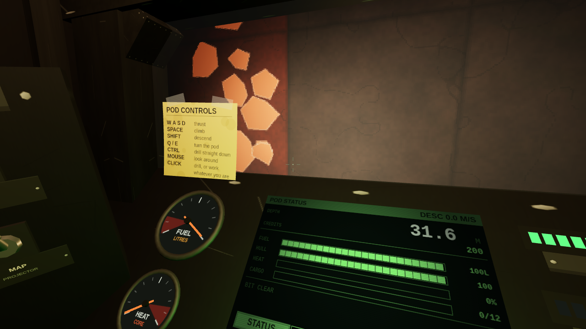
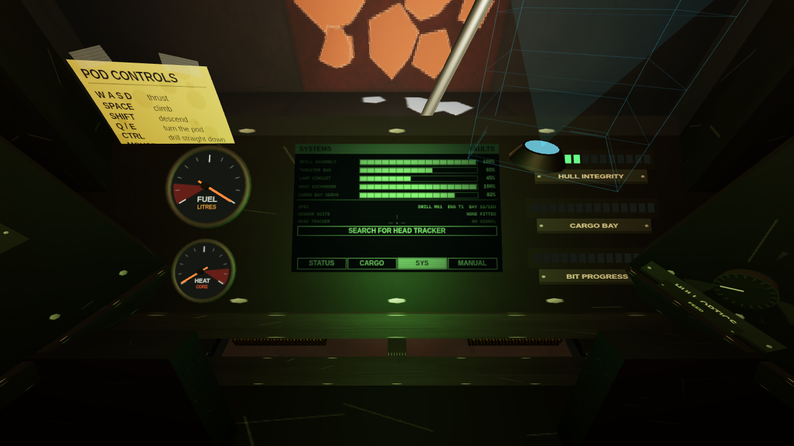

# MOTHERLOAD 3D

A browser-based 3D reimagining of the Flash game *Motherload*. You operate a one-seat
mining pod on Mars under contract to the financier **Mr. Natas**: dig, haul ore to the
surface, sell it, upgrade the pod, dig deeper. Something is waiting at the bottom.

Built with [three.js](https://threejs.org/) and Vite. Every model, texture and screen
is generated procedurally in code — the repository contains no art assets, only the
screenshots below.


## Play it

**In your browser, right now:**
[nickssoftwarefun.github.io/Opus-5-Motherload-Recreation](https://nickssoftwarefun.github.io/Opus-5-Motherload-Recreation/)
— rebuilt and redeployed by GitHub Actions on every push to the default branch.

**The easy way.** Download `motherload-3d.html` from the
[latest release](../../releases/latest) and double-click it. One file, no install, no
server, no internet. It works because the game has no assets to fetch — everything is
drawn at boot.

**From source:**

```bash
npm install
npm run dev            # http://127.0.0.1:5173
```

```bash
npm run build          # static bundle in dist/
npm run build:single   # one self-contained file in release/
npm run preview        # serve the built bundle
npm test               # 73 unit tests
npm run shots          # headless screenshot harness -> shots/
npm run audio          # measure the synthesised mix in a headless browser
npm run switches       # click every cockpit switch and check it stays thrown
npm run render         # render a scripted descent to a shareable audio file
npm run track          # OpenTrack head-tracking bridge (optional)
npm run jukebox        # the sound bench (see below)
npm run build:jukebox  # the sound bench as one self-contained file
```

Chrome, Edge and Firefox are all fine. You need WebGL2 and a mouse.

**Node 20.19+ or 22.12+** for anything that runs Vite. On an older Node every `npm`
script here dies with `'node:util' does not provide an export named 'styleText'`,
which is Vite's dependency failing, not this project. The two single-file builds in
`release/` need no Node at all, which is the point of them.

## How to play

The pod starts **switched off**. Look left, find the pulsing amber standby lamp, and
throw the master switch under it. The terminal will run its self-test and the main
menu will appear on that screen. Everything after that happens in the cockpit.

| Input | Does |
| --- | --- |
| `W` `A` `S` `D` | Thrust |
| `Space` | Lift |
| `C` | Descend |
| `Q` / `E` | Turn the pod |
| `Shift` | Drill straight down, regardless of where you are looking |
| Mouse | Move your head. Looking never steers the pod |
| Wheel | Zoom the canopy view in and out |
| Left click | Drill what the sight is on — **or** operate the switch, knob or screen region it is resting on |
| `F9` | Recentre head tracker |

The same list is written on a sticky note taped to the inside of the canopy, bottom
left, in case you forget it mid-shaft.

The pod is glazed like a helicopter: a deep windscreen, chin panels that carry on
down past your feet, and a port in the roof. The altimeter reads **AGL +N.N** while
there is air under the skids and switches back to depth once you are in the rock.

Fly to a landing pad and your terminal becomes that vendor's console. Sell ore at the
trader, refuel, repair, buy upgrades at the fitting shop, buy instruments at the sensor
bureau, and save your contract at the uplink tower. Then go back down.

Run out of hull or fuel underground and Mr. Natas comes and gets you. He charges.

## Screenshots

Every one of these is the real game, captured by the headless harness driving the same
code paths a player does. There is no HUD in any of them, because there is no HUD
anywhere in the project.

| | |
| --- | --- |
|  **Cold start.** The game opens with the pod switched off. A pulsing standby lamp throws amber light across the switch panel — the entire tutorial for how to begin. |  **The main menu is a boot screen.** Throw master power, the terminal POSTs, and NEW EXCAVATION is a button on that CRT. Note the last line of the self-test. |
|  **The switch bank.** Master power, exterior lamps, drill clutch, cargo release and the map projector. You look at them and click them; the headlights are not a keybind. |  **The claim.** Six installations ring the shaft mouth, each with a pad, a lit sign and a silhouette you can navigate by. |
|  **Cutting.** The drill points where you look — or straight down on `Shift` — and the sight is the boom's own optics. Ore is the only thing that glows down here. |  **Docking is proximity.** Land on a pad and your own terminal becomes that vendor's console. No shop overlay, nothing to dismiss. |
|  **Hull optics.** Three cameras, one CRT, one rotary knob. It is the only way to ever see the machine you are flying. |  **The mine map.** A projector on the dash throws up the claim with every metre you have cut, your pod inside it, and a tether to the surface. |
|  **The sensor racks.** They start empty. Each module the bureau sells bolts into a named bay, so you can see the holes in your own cockpit. |  **The Providence Engine.** 666,000 credits, sold without a specification. It shows you every seam within forty metres straight through the rock, and it bills you by the second. |
|  **Mr. Natas arrives as paper.** Transmissions clatter out of the printer beside the seat while you keep flying. Nothing stops the machine. |  **The bottom.** A chamber nobody excavated, and a door nobody built. |
|  **Even the manual is furniture.** The keybinds are on a curling note a previous pilot taped to the canopy glass, coffee ring and all. There is no controls overlay to open. |  **Faults, not hit points.** Five modules take damage separately and the schematic shows which one you just lost. The repair rig services them one at a time, and charges accordingly. |

## Design rules

Two rules drive nearly every decision in this codebase:

**Everything is diegetic.** There is no HUD, no menu, and no dialog drawn over the
scene. Fuel is a needle on a gauge. Hull integrity is a row of lamps. The shop is a
CRT terminal bolted to the console. The main menu is the pod's boot self-test. The
game-over screen is the emergency channel on that same terminal. The document body
contains a `<canvas>` and nothing else, and the screenshot harness asserts it on every
run so this cannot quietly erode.

**It should feel like operating machinery.** The interface language is MicroProse's,
and specifically *Carrier Command 2* (2021): physical switches you throw, chunky
monochrome phosphor screens in thick bezels, a holographic map projector, per-module
damage instead of a single health bar, and mission traffic that clatters out of a
dot-matrix teletype.

The one mechanic that makes it all reachable is the **look model**. The mouse moves
the pilot's head and nothing else — you can read a gauge on the far side of the cabin
without the pod drifting a degree. The pod turns on `Q` and `E`, like a machine with a
yaw thruster rather than a first-person shooter with a rifle. `Shift` overrides the aim
entirely and sinks the bit straight down, so the ordinary business of digging a shaft
does not require you to hold the sight steady on the floor.

## Sound

There are no audio files. Every sound in the game is synthesised at boot out of
oscillators, filtered noise and envelopes, for the same reason there are no texture
files — and it is mixed the way simulators mix, on four buses: a dry cabin, a mine
behind a small generated reverb, the environment behind that, and a score underneath
everything with a compressor across the lot.

**Things that run** are continuous voices driven by the simulation, not samples
triggered by it. The drill's timbre comes from the block under the bit: hardness
raises and tightens the band it grinds in, and ore opens a resonant ring pitched off
its value, so you hear that you have hit something worth stopping for before you look
down at the manifest. Thrusters have a hiss and a frame rumble. The map projector has
a fan. The cabin has a bus bar humming in it the moment you throw master power, which
is the whole opening of the game: a cold, silent cockpit that comes alive.

**Things you do** are mechanical and discrete. Switches clack, screen regions chirp,
the teletype hammers every character and slams its carriage at the end of a line, the
terminal thunks like a degaussing coil when it comes up, hydrazine gurgles into the
tank, the repair rig welds.

**Things going wrong** get klaxons — one at a time, most severe first, each with its
own cadence, so you can name the fault from across the cabin without reading the lamp.

**The environment plays itself.** Thin Mars wind on the surface crossfading into rock
pressure as you descend; the hull creaking more often the deeper and more damaged it
gets; magma audible through the rock before you cut into it.

And there is a **score, which is not a soundtrack**: a tempo-free chord that belongs
to the stratum you are in. The root walks down as you dig, the mode sours, the filter
closes, and by the bottom of the claim the harmony is a minor second against a
tritone. It ducks under the drill, leans in when the mine is winning, and is silent
when the pod is switched off. You can tell roughly how deep you are with your eyes
shut. `npm run audio` measures all of it in a headless browser, because a synthesised
mix fails silently, and `npm run render` drives the same audio module through a
scripted descent and writes the result to a file — a way to hear the whole arc
without playing, and the only way to share it.

## The Jukebox

```bash
npm run jukebox        # dev server
```

Or open `release/motherload-jukebox.html` — the same tool as one self-contained file,
built by `npm run build:jukebox`, which double-clicks open with no install. It is 46 kB
because there is nothing in it but code: every sound is synthesised on the spot.

A bench for the audio, at `tools/jukebox/`. It is a tool, not part of the game — it
imports the game's own `src/audio` modules and ships nothing back into them, so there
is no second copy of the synthesis to drift out of sync. If a pad there sounds wrong,
the game sounds wrong.

- **Sound board.** Every one-shot in the game as a pad, each with the design note for
  why it is shaped the way it is. <kbd>Shift</kbd>-click fires one ten times in a row,
  which is how you find out whether a sound survives being heard a hundred times a run.
- **Machinery.** The continuous voices, driven by hand: pick the block under the bit
  and hear the drill retune to it, ride the thrusters, hold a klaxon on.
- **The environment.** The beds and the score, driven exactly as `main.js` drives them.
  Drag the depth slider — or press the descend button and ride 0 → 256 m over a minute.
- **Why it turns sinister.** The six strata with their chord, their filter cutoff, and a
  *sensory roughness* figure computed from the actual intervals with Plomp–Levelt over
  the first six partials of every chord tone. The mood is not a setting anybody typed
  in; the number climbs from 0.52 at the surface to 1.96 at the bottom because those
  intervals do that to an ear.
- **A designer.** Stack `tone()` and `burst()` layers, audition them, and copy out code
  that drops into `src/audio/audio.js` unchanged.

A log-frequency spectrum and a waveform run across the top, tapped off the master bus.
Nothing sounds until you click **ARM AUDIO** — a browser will not start an AudioContext
without a gesture, and the whole tool is one AudioContext.

`npm run jukebox-check` drives it in headless Chromium and asserts the pads fire, the
machinery makes level, and the scopes actually paint. It runs twice: once against the
source and once against the built single file over `file://`, because the single-file
transform re-emits everything as one inlined script and has broken silently before.

## What is in it

- A 64 × 64 × 256 m voxel claim with ten ores on overlapping depth bands, natural
  voids, magma and pressurised gas. Deterministic from a seed.
- Six upgrade lines of six tiers: drill, hull, tank, engine, cooling, cargo bay.
- Six surface installations, all transacted on the pod's own terminal.
- Six sensor modules, each a physical fitting: densitometer, chirp sonar, strata
  profiler, thermal aperture, tomographic lattice, and the Providence Engine.
- Per-module damage — a bad landing costs you a headlight, not just a number. So does
  a wall, a ceiling, or the side of a hydrazine tank, at any angle you like.
- Every instrument carries its own manual: a "?" in the corner of the tube explains
  what it is showing you, and the same box closes it again.
- Hazards that each teach a different lesson: magma, gas detonation, collapses, quakes.
- Optional OpenTrack head tracking with real positional parallax.
- A complete synthesised sound suite with no audio files: machinery that responds to
  load, per-fault klaxons, environmental beds that crossfade with depth, and a score
  whose harmony is chosen by the stratum you are standing in.
- Saves that are the world seed plus the voxels you changed, so they weigh kilobytes.

## Head tracking (OpenTrack)

Optional, and off unless you run the bridge. A browser cannot open a UDP socket and
OpenTrack cannot speak WebSocket, so a small Node process sits between them:

```bash
npm run track      # listens on udp://0.0.0.0:4242, serves ws://127.0.0.1:4243
```

In OpenTrack, set **Output** to *UDP over network* and remote port `4242`. The remote
address can be `127.0.0.1` **or** the machine's own LAN address — the bridge binds every
interface, so either works. On startup it prints all the addresses it can be reached on;
point OpenTrack at any of them. Start tracking, then load the game — it connects on its
own, and gives up quietly if the bridge is not there.

If the pose never moves, the bridge tells you what is wrong: it logs the source of the
first packet it receives, and if nothing arrives within a few seconds it says so and
lists the addresses to try. A firewall prompt for `node.exe` on the first run is normal
and must be allowed.

The tracker only moves the pilot's head **inside the cabin** — it can never turn the
pod, so leaning to see past a canopy pillar is always free. Positional tracking is wired
to real parallax against the canopy frame and the side consoles.

- `F9`, or the button on the terminal's SYS page, recentres. The first pose received
  also becomes centre automatically.
- `?track=off` disables it. `?track=host:port` points at a bridge on another machine.
- Gains, clamps and smoothing live in `DEFAULTS` in `src/core/headTracking.js`. If an
  axis moves the wrong way, negate its gain — OpenTrack's sign conventions depend on
  which tracker and filter chain you are using.

## Layout

| Path | What lives there |
| --- | --- |
| `src/core/` | Seeded RNG and noise, fixed-timestep loop, input, head tracking |
| `src/world/` | Voxel storage, generation, chunk meshing, ray traversal |
| `src/player/` | Pod state, physics, drilling, subsystems, hazards, sensor sampling |
| `src/render/` | Scene, surface, base, cockpit, instruments, sensors, effects |
| `src/ui/` | Diegetic CRT screens and the pages drawn onto them |
| `src/game/` | Economy, stations, sensors, narrative, saves, session state |
| `tests/` | Unit tests for everything that does not need a GPU |
| `tools/` | OpenTrack bridge, and the Jukebox sound bench |
| `scripts/` | Headless capture and audio harnesses |

Coordinates: world space is metres, Y-up, and **Y = 0 is the Martian surface**. The
mine occupies a 64 × 64 m claim extending 256 m straight down, so a voxel's depth in
metres is simply `-y`, and voxel layers align to integer world Y — which is why
collision needs no scaling anywhere.

## Tests

```bash
npm test
```

73 unit tests covering voxel indexing and the out-of-bounds conventions, mesher face
counts and culling, ray traversal against oblique tunnelling, collision and fall
impacts, the ore rarity ladder and depth bands, the upgrade price curve, subsystem
degradation, hazard fuses and collapse support rules, sensor sampling, narrative beat
firing, and save round-trips.

The generation tests are the interesting ones: they assert that each ore is strictly
rarer than the cheaper tier below it, which caught a real bug where bronzium was more
common than ironium because ironium's band was centred shallow enough that the surface
clipped half its bell curve.
