# MOTHERLOAD 3D

A browser-based 3D reimagining of the Flash game *Motherload*. You operate a one-seat
mining pod on Mars under contract to the financier **Mr. Natas**: dig, haul ore to the
surface, sell it, upgrade the pod, dig deeper. Something is waiting at the bottom.

Built with [three.js](https://threejs.org/) and Vite. Every model, texture and screen
is generated procedurally in code — the repository contains no art assets, only the
screenshots below.

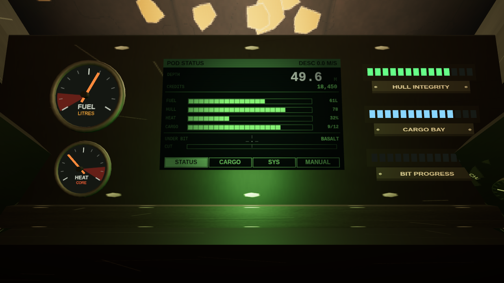

## Play it

**The easy way.** Download `motherload-3d.html` from the
[latest release](../../releases/latest) and double-click it. One file, no install, no
server, no internet. It works because the game has no assets to fetch — everything is
drawn at boot.

**From source:**

```bash
npm install
npm run dev            # http://127.0.0.1:5173
```

```bash
npm run build          # static bundle in dist/
npm run build:single   # one self-contained file in release/
npm run preview        # serve the built bundle
npm test               # 56 unit tests
npm run shots          # headless screenshot harness -> shots/
npm run track          # OpenTrack head-tracking bridge (optional)
```

Chrome, Edge and Firefox are all fine. You need WebGL2 and a mouse.

## How to play

The pod starts **switched off**. Look left, find the pulsing amber standby lamp, and
throw the master switch under it. The terminal will run its self-test and the main
menu will appear on that screen. Everything after that happens in the cockpit.

| Input | Does |
| --- | --- |
| `W` `A` `S` `D` | Thrust |
| `Space` | Lift |
| `Ctrl` / `Shift` | Descend |
| Mouse | Move your head. Past a detent, the pod follows your gaze |
| Left click | Drill what the sight is on — **or** operate the switch, knob or screen region it is resting on |
| `F9` | Recentre head tracker |

Fly to a landing pad and your terminal becomes that vendor's console. Sell ore at the
trader, refuel, repair, buy upgrades at the fitting shop, buy instruments at the sensor
bureau, and save your contract at the uplink tower. Then go back down.

Run out of hull or fuel underground and Mr. Natas comes and gets you. He charges.

## Screenshots

Every one of these is the real game, captured by the headless harness driving the same
code paths a player does. There is no HUD in any of them, because there is no HUD
anywhere in the project.

| | |
| --- | --- |
| 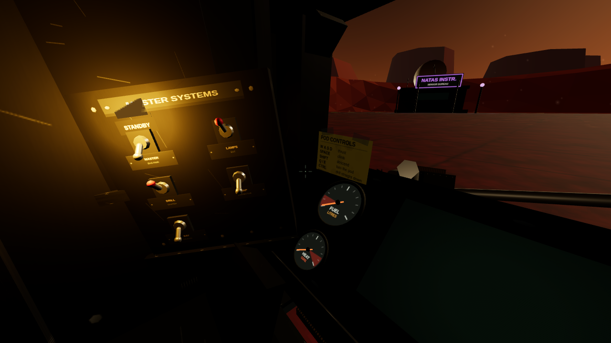 **Cold start.** The game opens with the pod switched off. A pulsing standby lamp throws amber light across the switch panel — the entire tutorial for how to begin. | 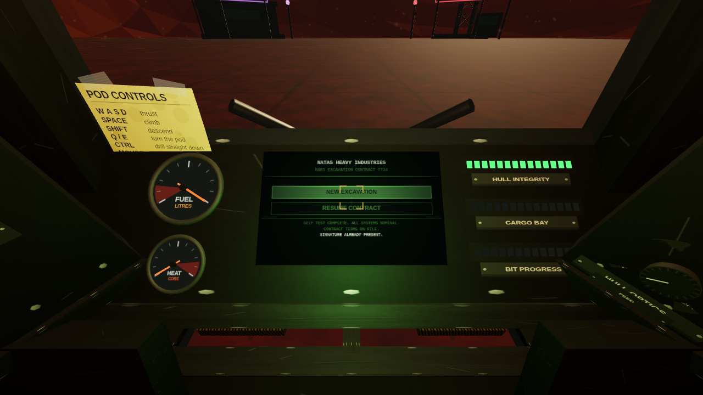 **The main menu is a boot screen.** Throw master power, the terminal POSTs, and NEW EXCAVATION is a button on that CRT. Note the last line of the self-test. |
| 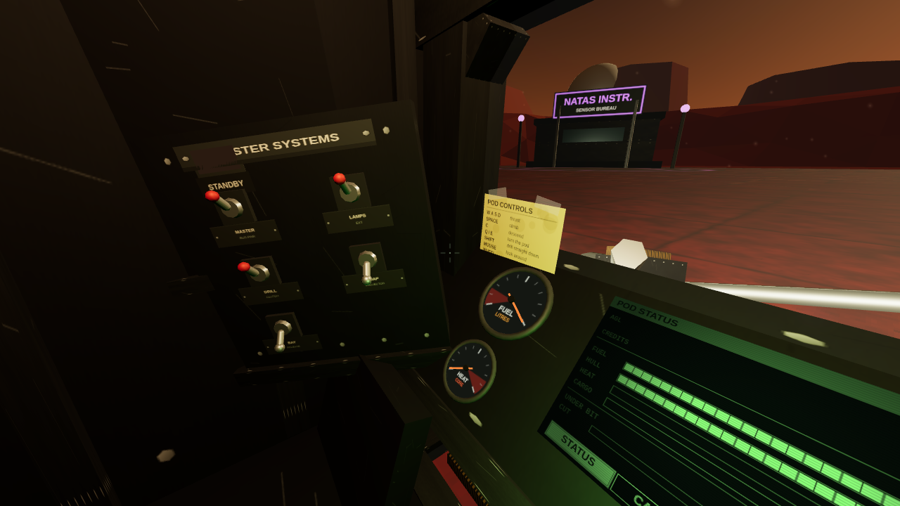 **The switch bank.** Master power, exterior lamps, drill clutch, cargo release and the map projector. You look at them and click them; the headlights are not a keybind. | 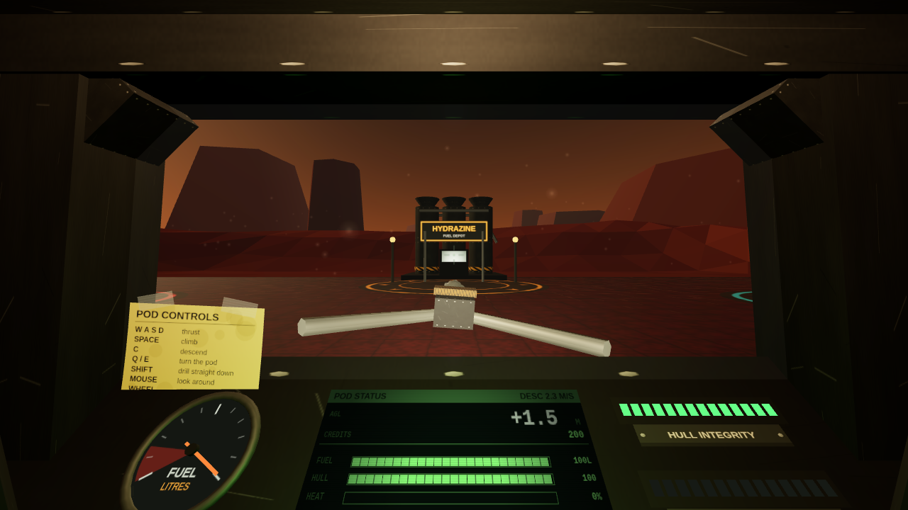 **The claim.** Six installations ring the shaft mouth, each with a pad, a lit sign and a silhouette you can navigate by. |
| 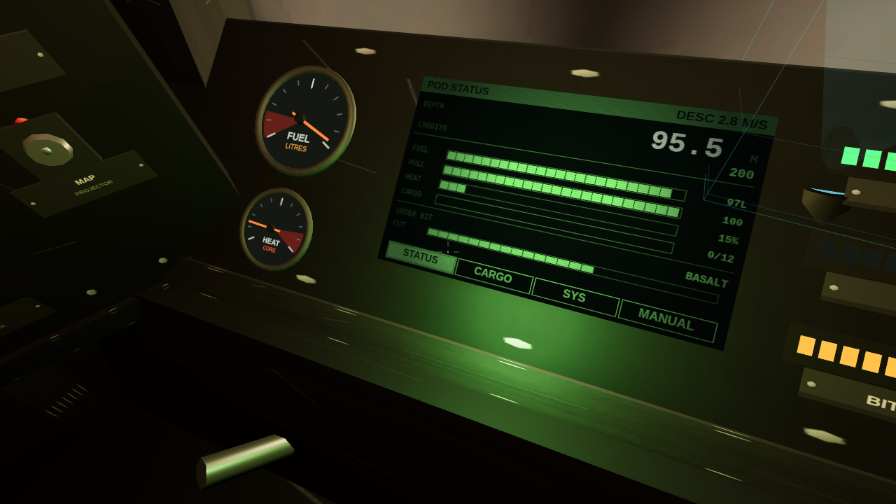 **Cutting.** The drill points wherever you look, and the sight is the boom's own optics. Ore is the only thing that glows down here. | 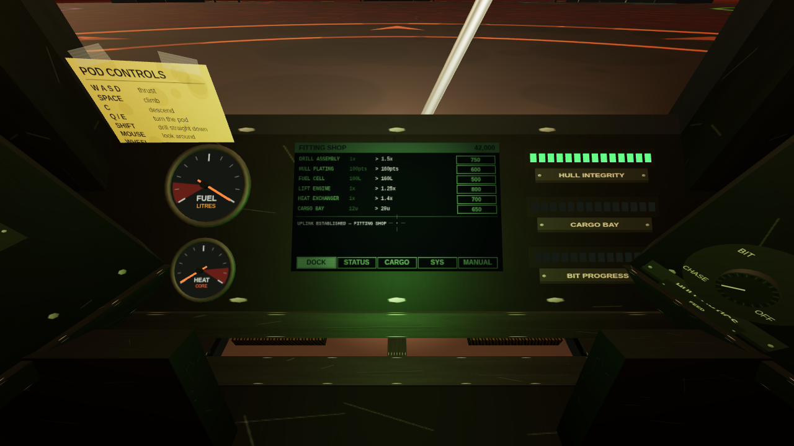 **Docking is proximity.** Land on a pad and your own terminal becomes that vendor's console. No shop overlay, nothing to dismiss. |
| 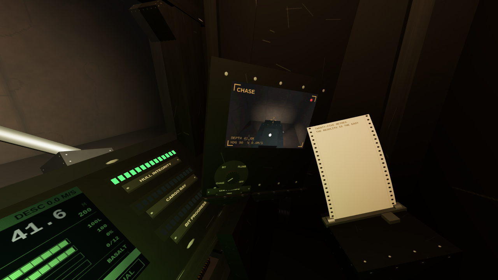 **Hull optics.** Three cameras, one CRT, one rotary knob. It is the only way to ever see the machine you are flying. | 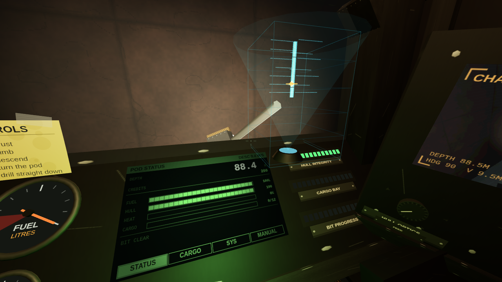 **The mine map.** A projector on the dash throws up the claim with every metre you have cut, your pod inside it, and a tether to the surface. |
| 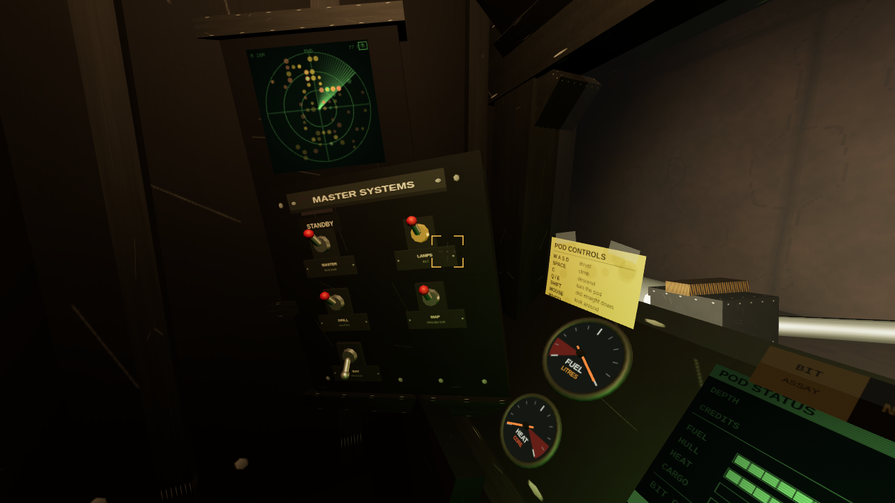 **The sensor racks.** They start empty. Each module the bureau sells bolts into a named bay, so you can see the holes in your own cockpit. | 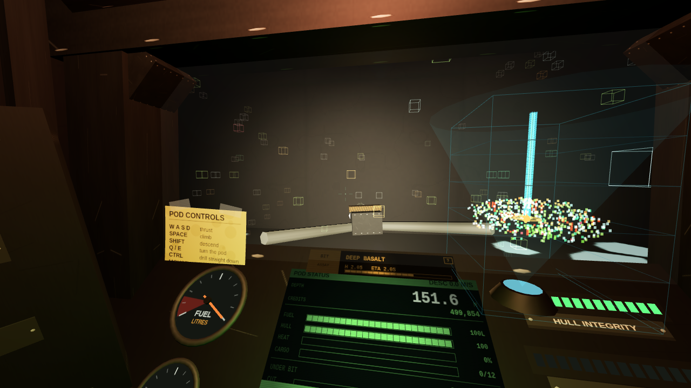 **The Providence Engine.** 666,000 credits, sold without a specification. It shows you every seam within forty metres straight through the rock, and it bills you by the second. |
| 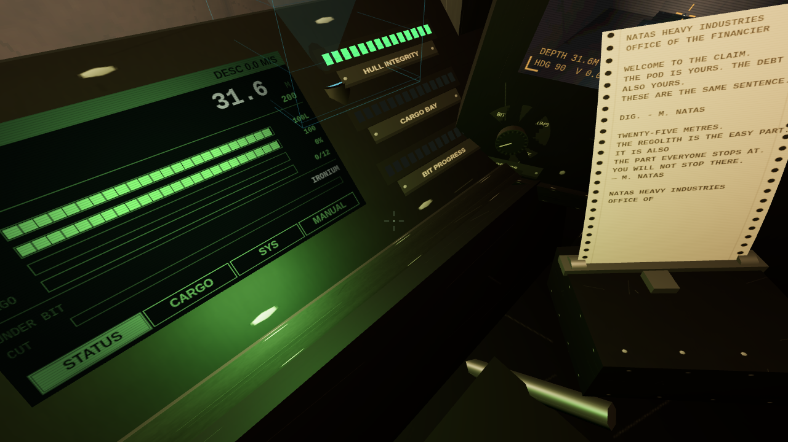 **Mr. Natas arrives as paper.** Transmissions clatter out of the printer beside the seat while you keep flying. Nothing stops the machine. | 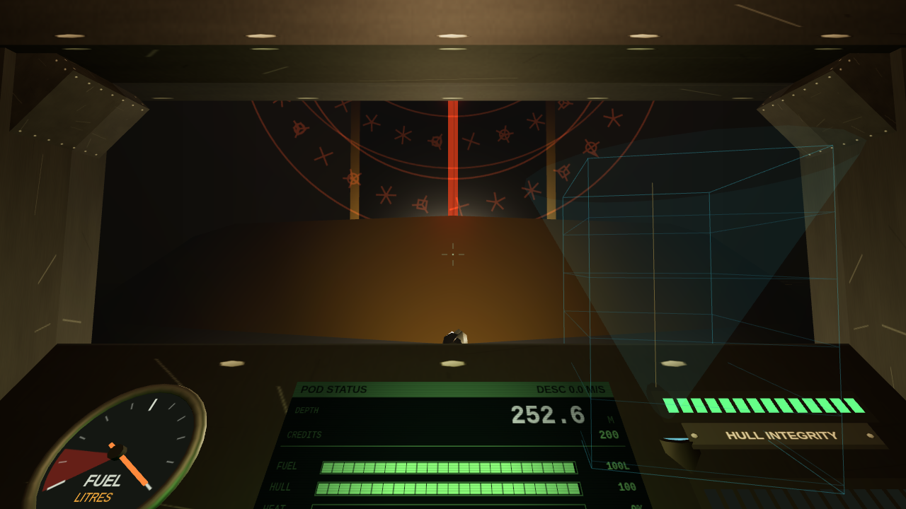 **The bottom.** A chamber nobody excavated, and a door nobody built. |

## Design rules

Two rules drive nearly every decision in this codebase:

**Everything is diegetic.** There is no HUD, no menu, and no dialog drawn over the
scene. Fuel is a needle on a gauge. Hull integrity is a row of lamps. The shop is a
CRT terminal bolted to the console. The main menu is the pod's boot self-test. The
game-over screen is the emergency channel on that same terminal. The document body
contains a `<canvas>` and nothing else, and the screenshot harness asserts it on every
run so this cannot quietly erode.

**It should feel like operating machinery.** The interface language is MicroProse's,
and specifically *Carrier Command 2* (2021): physical switches you throw, chunky
monochrome phosphor screens in thick bezels, a holographic map projector, per-module
damage instead of a single health bar, and mission traffic that clatters out of a
dot-matrix teletype.

The one mechanic that makes it all reachable is the **look model**. Mouse movement
turns the pilot's *head*, not the pod; past a detent the pod follows your gaze and
catches up. Small movements look around the cabin, large ones steer — and the follow
disengages when you are parked, so a panel you turn to read stays where you put it.

## What is in it

- A 64 × 64 × 256 m voxel claim with ten ores on overlapping depth bands, natural
  voids, magma and pressurised gas. Deterministic from a seed.
- Six upgrade lines of six tiers: drill, hull, tank, engine, cooling, cargo bay.
- Six surface installations, all transacted on the pod's own terminal.
- Six sensor modules, each a physical fitting: densitometer, chirp sonar, strata
  profiler, thermal aperture, tomographic lattice, and the Providence Engine.
- Per-module damage — a bad landing costs you a headlight, not just a number.
- Hazards that each teach a different lesson: magma, gas detonation, collapses, quakes.
- Optional OpenTrack head tracking with real positional parallax.
- Saves that are the world seed plus the voxels you changed, so they weigh kilobytes.

## Head tracking (OpenTrack)

Optional, and off unless you run the bridge. A browser cannot open a UDP socket and
OpenTrack cannot speak WebSocket, so a small Node process sits between them:

```bash
npm run track      # binds udp://127.0.0.1:4242, serves ws://127.0.0.1:4243
```

In OpenTrack, set **Output** to *UDP over network*, remote host `127.0.0.1`, remote
port `4242`. Start tracking, then load the game — it connects on its own, and gives up
quietly if the bridge is not there.

The tracker only moves the pilot's head **inside the cabin**. Mouse yaw still steers
the pod through the follow detent, and the detent reads only the mouse component, so
leaning to see past a canopy pillar never sends the pod into a spin. Positional
tracking is wired to real parallax against the canopy frame and the side consoles.

- `F9`, or the button on the terminal's SYS page, recentres. The first pose received
  also becomes centre automatically.
- `?track=off` disables it. `?track=host:port` points at a bridge on another machine.
- Gains, clamps and smoothing live in `DEFAULTS` in `src/core/headTracking.js`. If an
  axis moves the wrong way, negate its gain — OpenTrack's sign conventions depend on
  which tracker and filter chain you are using.

## Layout

| Path | What lives there |
| --- | --- |
| `src/core/` | Seeded RNG and noise, fixed-timestep loop, input, head tracking |
| `src/world/` | Voxel storage, generation, chunk meshing, ray traversal |
| `src/player/` | Pod state, physics, drilling, subsystems, hazards, sensor sampling |
| `src/render/` | Scene, surface, base, cockpit, instruments, sensors, effects |
| `src/ui/` | Diegetic CRT screens and the pages drawn onto them |
| `src/game/` | Economy, stations, sensors, narrative, saves, session state |
| `tests/` | Unit tests for everything that does not need a GPU |
| `tools/` | OpenTrack bridge |
| `scripts/` | Headless capture harness |

Coordinates: world space is metres, Y-up, and **Y = 0 is the Martian surface**. The
mine occupies a 64 × 64 m claim extending 256 m straight down, so a voxel's depth in
metres is simply `-y`, and voxel layers align to integer world Y — which is why
collision needs no scaling anywhere.

## Tests

```bash
npm test
```

56 unit tests covering voxel indexing and the out-of-bounds conventions, mesher face
counts and culling, ray traversal against oblique tunnelling, collision and fall
impacts, the ore rarity ladder and depth bands, the upgrade price curve, subsystem
degradation, hazard fuses and collapse support rules, sensor sampling, narrative beat
firing, and save round-trips.

The generation tests are the interesting ones: they assert that each ore is strictly
rarer than the cheaper tier below it, which caught a real bug where bronzium was more
common than ironium because ironium's band was centred shallow enough that the surface
clipped half its bell curve.
